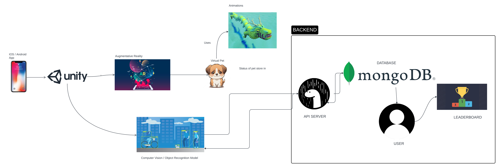

# System Block Diagram

Figure 1. High level design of the AR Pets Pals application
Figure 1 depicts the high-level design of the application from a user's mobile device. They will be able to open the app on their mobile device and start interacting with their virtual pet. The application will run on Unity, a cross-platform game engine, which will then interact with a augmented reality engine that will create a pet of their choice. That pet will later be able to recognize real-world objects around it using Object Recognition and be able to interact with them using animations. The main idea of the pet is to make it content or not based on food that you eat, it will be able to analyze your food and determine how healthy that food is, which will make it sad/angry or happy. Users will compete with other users based on their pet’s status. 

