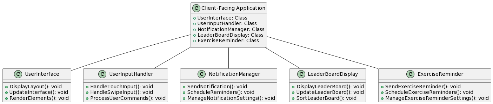
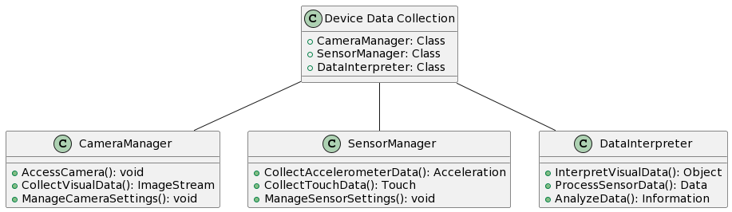
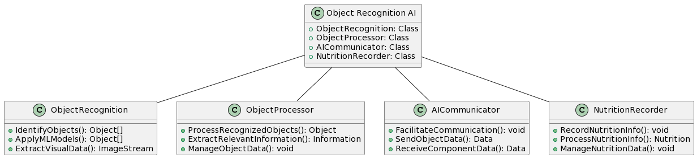
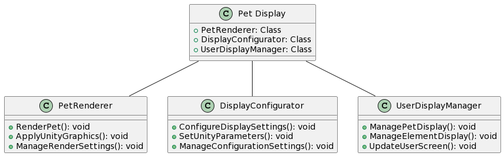
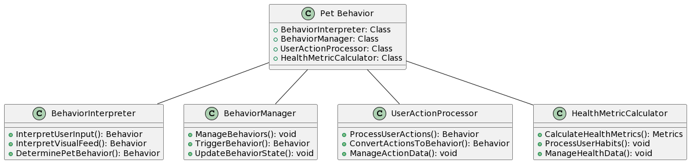
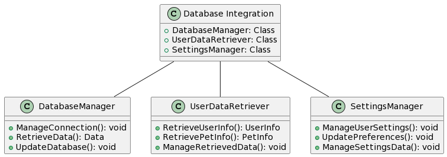

Components
=============================

## Client-Facing Application

This component is what the client sees when they open the application. Every bit of user interaction is prompted and handled through here.

**Classes**
- UserInterface: Handles the display and layout of the user interface.
- UserInputHandler: Manages user interactions and inputs.
- NotificationManager: Sends reminders and notifications to the user.
- LeaderBoardDisplay: Manages the display of the public leaderboard.
- ExerciseReminder: Sends reminders to users to interact with their pet by exercising.

## Device Data Collection

Since this application heavily relies on AR, sensor and visual data has to be constantly collected and interpreted. While the camera is the most used portion of the application, sensors such as touch and accelerometer may also provide crucial information to support a positive and seamless user experience.

**Classes**
- CameraManager: Manages camera access and data collection.
- SensorManager: Manages the collection of data from various sensors like accelerometer and touch.
- DataInterpreter: Interprets and processes the collected sensor and visual data.

## Object Recognition AI

Once connection with the camera has been established, AR Pet Pals needs to extract relevant objects from the visual feed. Object recognition and machine learning approaches will be employed here to ensure that the app can communicate the objects it sees with the rest of the software.

**Classes**
- ObjectRecognition: Identifies objects from the camera feed using machine learning models.
- ObjectProcessor: Processes recognized objects and extracts relevant information.
- AICommunicator: Facilitates communication between the object recognition component and other components.
- NutritionRecorder: Records and processes the nutrition information of the food recognized by the object recognition AI.

## Pet Display

The pet itself will be displayed using the advanced graphics technology, Unity. To allow for Unity to properly display the results classes have to be created receive configuration details and to carry the visual to the user display.

**Classes**
- PetRenderer: Renders the pet on the screen using Unity.
- DisplayConfigurator: Configures display settings and parameters for Unity.
- UserDisplayManager: Manages the display of the pet and other elements on the user screen.

## Pet Behavior

Based on user actions and other factors, the pet can exhibit a variety of behaviors on-screen. This component interprets user input, the visual feed, and other inputs and converts them into pet behaviors.

**Classes**
- BehaviorInterpreter: Interprets user input, visual feed, and other inputs to determine pet behavior.
- BehaviorManager: Manages the different behaviors the pet can exhibit.
- UserActionProcessor: Processes user actions and converts them into corresponding pet behaviors.
- HealthMetricCalculator: Calculates the health metrics of the pet based on user diet and exercise habits.

## Database Integration
User and pet information will be stored in a connected database. Upon reboots of the app, new users logging, or major setting changes, the database will accessed to retrieve relevant data. This database will be hosted on an Microsoft Azure Linux server which will be hosted on the cloud, and will have an API that will connect the application with said said database. This API should only let authorized users access database resources like pet information, and should keep the user's data confidential and safe.

**Classes**
- DatabaseManager: Manages connections, retrievals, and updates to the database.
- UserDataRetriever: Retrieves user and pet information from the database.
- SettingsManager: Manages user settings and preferences and updates them in the database.

