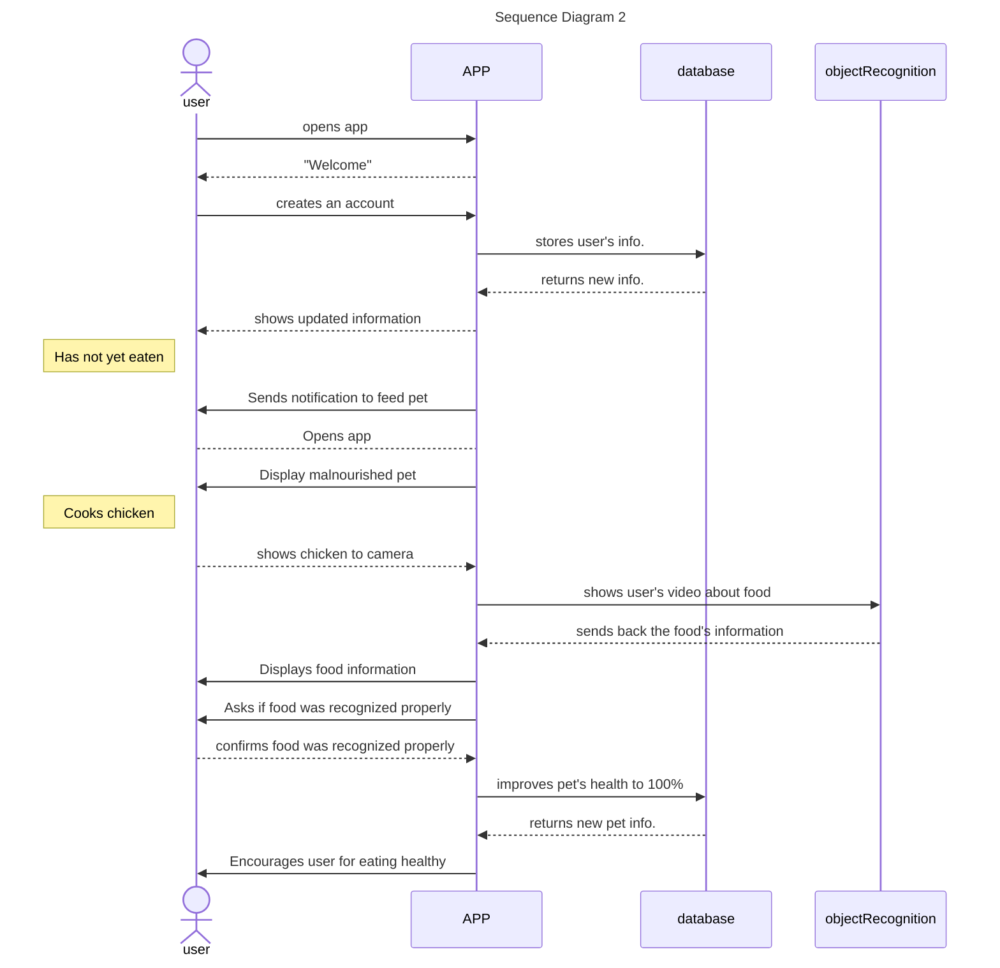
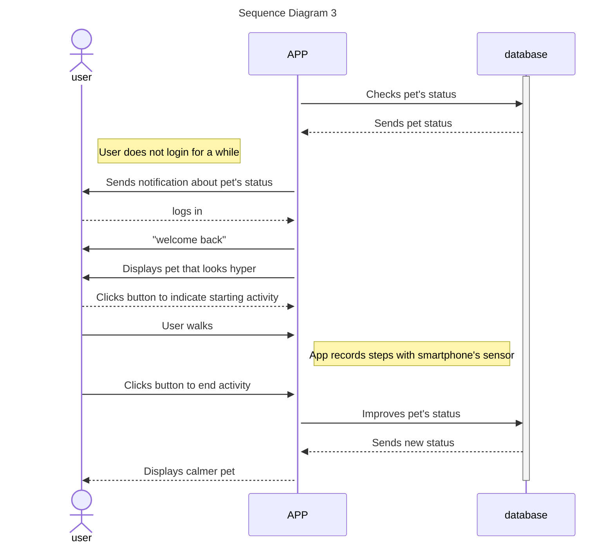
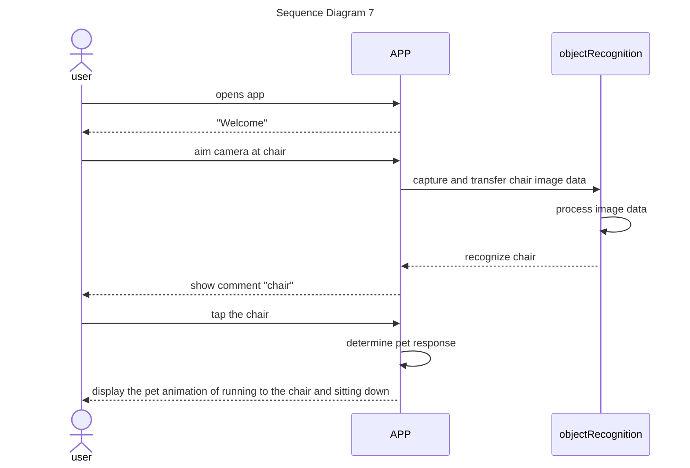

Sequence Diagrams
=============================


## Use case 2

```text
## Use Case 2- APP Helping User Make Healthier Food Choices
1. A user is a works from home and is trying to improve their eating habits.
2. User downloads ARPP to aid their nutrition goals and creates an account. 
3. User has been working for hours and has not eaten.
4. User receives a notification from the app reminding them to feed their pet. 
5. User opens the app and sees their virtual pet sitting on their desk, looking very malnourished and weak. 
6. User cooks a chicken breast.
7. User points the camera at its food and the app recognizes the food correctly, asking the user to verify. 
8. User taps a button to confirm that the food is correctly recognized. 
9. The virtual pet is now nourished and at100% health due to the high nutritional value of the chicken breast.
10. The user is encouraged by their pets' happiness and continues to eat healthier meals. 
```


## Use case 3


```text
## Use Case 3- APP Helping User Keep Active
1. A user is a software engineer working from home full time and has eaten but has not moved in a while due to several long morning zoom meetings.
2. The user receives a notification from the app letting them know that their pet is in need of a walk. 
3. The user opens the app and sees their virtual pet in their room, looking very hyper and needing exercise. The pet’s happiness bar is low. 
4. The user taps a button to indicate they are starting their activity.
5. The user stands up and takes a walk down their hallway and back to their room. 
6. The app tracks the users steps using their smartphones built in hardware sensors. 
7. The user taps a button on the app to record their activity. 
8. The virtual pet is seen on screen in the users room visibly calmer/happier, and its health bar is at 100%.
```


## Use case 7



```text
## Use Case 7- Environment Engagement
1. A user is a work from home and wants to be entertained by how the virtual pet's interactions with the real world environment.
2. The user opens ARPetPals app.
3. The user aims the camera at a chair next to him.
4. The app captures and transfers the chair's image data to the object recognition component.
5. The object recognition component processes the image data, recognizes the chair, and send the result back to the app.
6. The app informs the user the recognized object by displaying a comment "chair."
7. The user wants the virtual pet seated next to him.
8. The user tap the chair.
9. The app responds to the user by displaying an animation of the virtual pet running to the chair and sitting down.
```