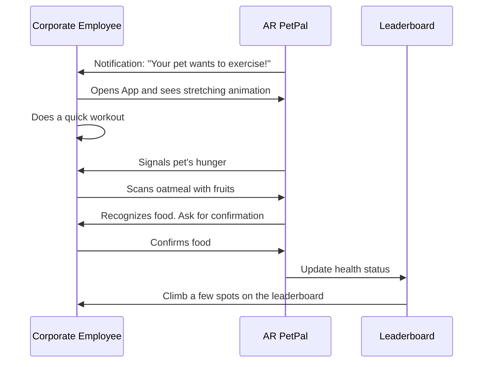
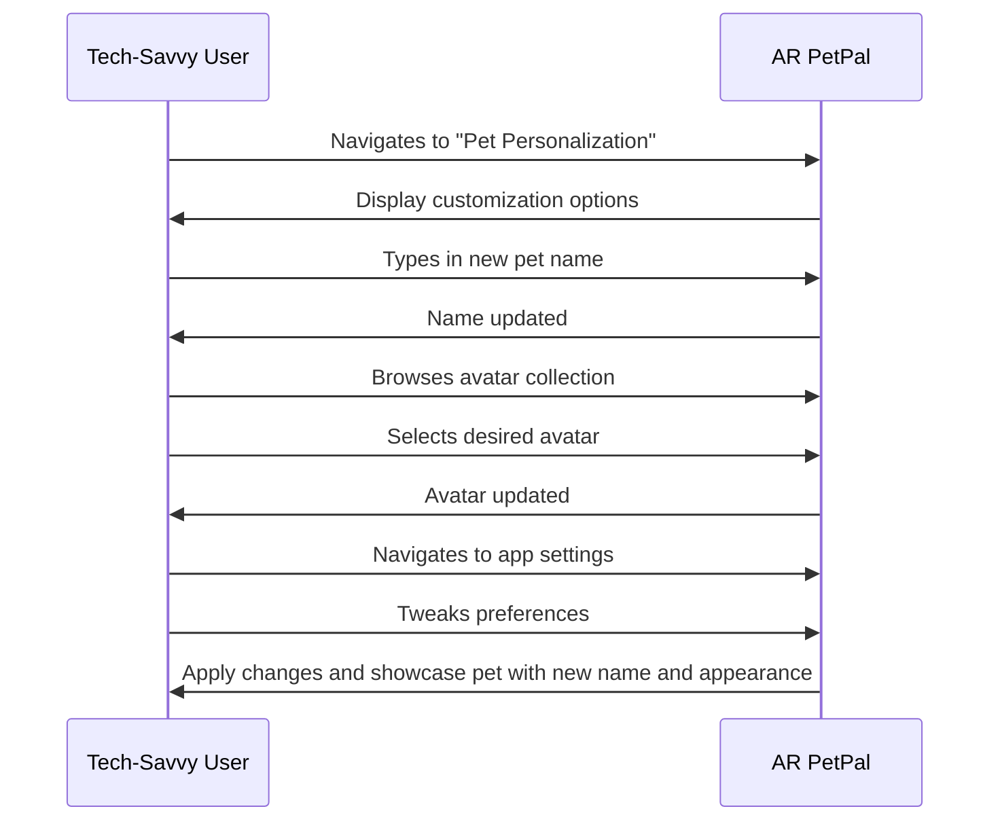
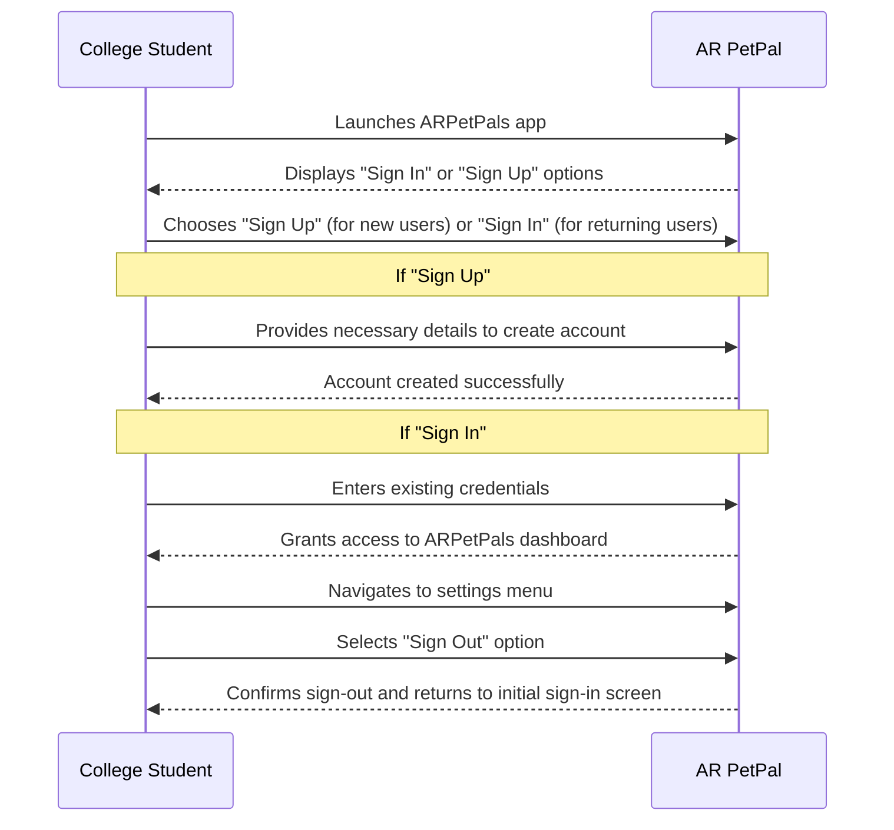
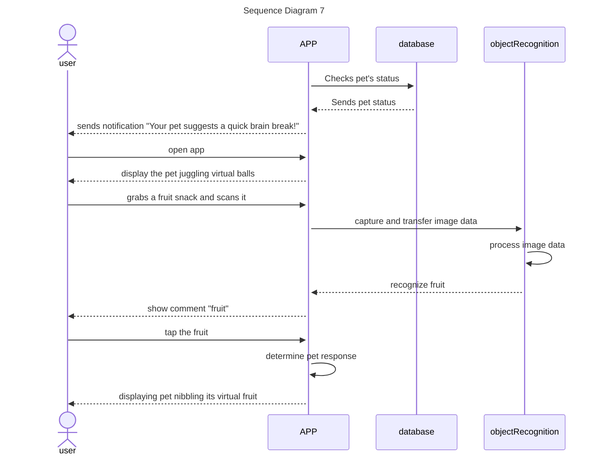
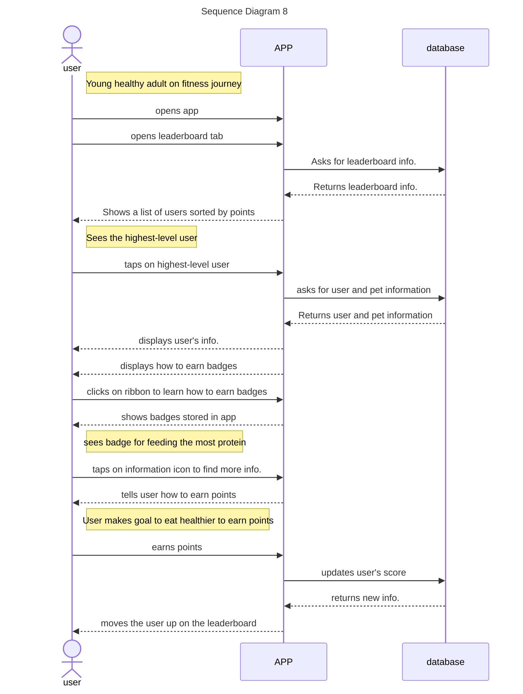

# Sequence Diagrams

## Use case 2


```text
## Use Case 2- APP Helping User Make Healthier Food Choices
1. A user is a works from home and is trying to improve their eating habits.
2. User downloads ARPP to aid their nutrition goals and creates an account.
3. User has been working for hours and has not eaten.
4. User receives a notification from the app reminding them to feed their pet.
5. User opens the app and sees their virtual pet sitting on their desk, looking very malnourished and weak.
6. User cooks a chicken breast.
7. User points the camera at its food and the app recognizes the food correctly, asking the user to verify.
8. User taps a button to confirm that the food is correctly recognized.
9. The virtual pet is now nourished and at100% health due to the high nutritional value of the chicken breast.
10. The user is encouraged by their pets' happiness and continues to eat healthier meals.
```

## Use case 3


```text
## Use Case 3- APP Helping User Keep Active
1. A user is a software engineer working from home full time and has eaten but has not moved in a while due to several long morning zoom meetings.
2. The user receives a notification from the app letting them know that their pet is in need of a walk.
3. The user opens the app and sees their virtual pet in their room, looking very hyper and needing exercise. The pet’s happiness bar is low.
4. The user taps a button to indicate they are starting their activity.
5. The user stands up and takes a walk down their hallway and back to their room.
6. The app tracks the users steps using their smartphones built in hardware sensors.
7. The user taps a button on the app to record their activity.
8. The virtual pet is seen on screen in the users room visibly calmer/happier, and its health bar is at 100%.
```

## Use case 4



```text
## Use Case 4 - Competitive Leaderboard
1. A corporate employee who's been working from home due to recent global circumstances. With a sedentary lifestyle, they struggle to incorporate regular exercise into their daily routine.
2. User wakes up to a notification: "Your pet wants to exercise!"
3. User opens the app, sees the pet stretching, and does a quick workout.
4. Post-workout, the pet signals it's hungry.
5. User makes oatmeal with fruits and scans it with the app.
6. App recognizes food, the user confirms, and the pet eats.
7. Pet's health improves, and the user climbs a few spots on the leaderboard.
```

## Use case 5



```text
## Use Case 5 - Pet Personalization
1. A tech-savvy user who enjoys personalizing digital platforms to reflect their preferences. They want their virtual pet to be unique and resonate with their style.
2. User navigates to the "Pet Personalization" section in the app.
3. User decides to give their pet a new name and types it in.
4. User then browses through a collection of avatars, selecting the one they find most appealing.
5. Wanting more control, the user goes into the app settings to tweak preferences to their liking.
6. Upon finishing the customization, the app showcases the pet with its new name and appearance.
```

## Use case 6



```text
## Use Case 6 - User Sign-In and Sign-Out
1. A college student eager to engage with digital platforms in their leisure time. They want to securely access their ARPetPals account and ensure they can log out to protect their data.
2. Upon launching the ARPetPals app, the user is greeted with options: "Sign In" or "Sign Up".
3. If new to the platform, the user taps on "Sign Up", providing the necessary details to create their account.
4. If returning, the user taps on "Sign In", entering their existing credentials to access the app.
5. While enjoying their ARPetPals experience, the user decides to take a break and ensure their account is secure.
6. Navigating to the settings menu, the user spots the "Sign Out" option and taps on it.
7. The app confirms their sign-out.
```

## Use case 7



```text
## Use Case 7- Environment Engagement
1. A user is a high school student preparing for exams and requires short breaks to stay efficient.
2. After two hours of studying, the app prompts: "Your pet suggests a quick brain break!"
3. User opens the app to see the pet juggling virtual balls.
4. User attempts to mimic the juggling, causing some laughter and relaxation.
5. The user grabs a fruit snack and scans it.
6. Pet nibbles its virtual fruit, and both feel rejuvenated.
7. The user returns to studying, feeling more refreshed and focused.
```

## Use Case 8 

```text
## Use Case 8- APP Creating a Competetive Interactive Health Experience
1. User is a young adult on a fitness journey with friends.
2. User has been keeping up with their health and nutrition goals using the app and interacting with their virtual pet.
3. At the end of the week, user opens the app and taps on the leaderboard tab.
4. Sees the users with the most amount of points.
5. Taps on another user’s username and sees their profile, pet’s health score, and badges.
6. Taps on ribbon icon to see how to earn badges.
7. Sees that there is a badge for feeding virtual pet the most protein in grams/week.
8. User taps on the information circle icon to see what tasks reward users with points.
9. User makes new goal to eat more protein this next week so they can get higher on the leaderboard and compete with their friends.
10. User earns points and moves up on the leaderboard.
```