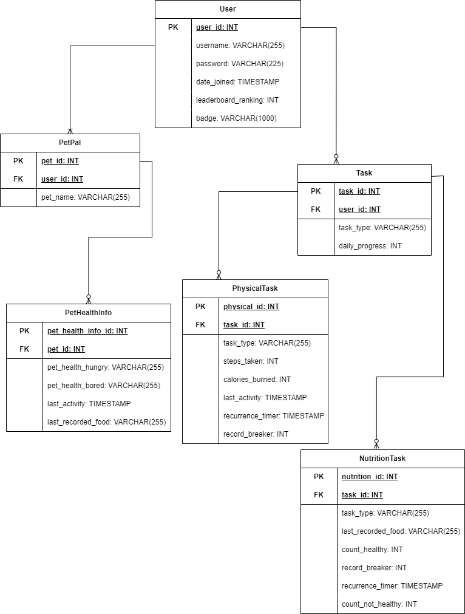

ER Diagram and Table Design
=============================

## ER Diagram

## Table Design
### User
- user_id (pk): Unique identifier assigned to each user of the app.
- username: Represents the user’s chosen display name.
- password: Encrypted string used for authenticating the user during login.
- date_joined: Timestamp noting when the user joined or created an account.
- leaderboard_ranking: The user’s current ranking on the leaderboard.
- badge: String noting any of the user's earned achievements or medals.

### PetPal
- pet_id (pk): Unique identifier assigned to each virtual pet in the application.
- user_id (fk): Foreign key referencing the User table, denoting the owner of the pet.
- pet_name: Represents the name of the virtual pet.

### PetHealthInfo
- pet_health_info_id (pk): Unique Identifier assigned to each record of pet health.
- pet_id (fk): Foreign key referencing the PetPal table.
- pet_health_hungry: String indicating the hunger level of the pet.
- pet_health_bored: String indicating the pet's boredom status.
- last_activity: Timestamp of the most recent activity performed by or with the virtual pet.
- last_recorded_food: String noting the most recent food eaten by the pet.

### Task
- task_id (pk): Unique identifier referencing the specific task the user is completing.
- task_type: Represents the type of task, such as walking or eating healthy.
- user_id (fk): Foreign key that references the User table, denoting the user who performed the task.
- daily_progress: Integer describing the user's daily progress status for completing the corresponding task.

### PhysicalTask
- physical_id (pk): Unique identifier referencing the specific physical task the user is performing.
- task_id (fk): Foreign key referencing the Task table.
- task_type: Represents the type of physical activity task, such as walking or running.
- steps_taken: Integer noting the number of steps taken during that particular physical activity.
- calories_burned: Integer representing the number of calories burned during the activity.
- last_activity: Timestamp of the user's most recent physical activity.
- recurrence_timer: Timestamp indicating the next scheduled time for a physical activity task.
- record_breaker: Integer indicating whether the user has surpassed their previous task-related records.

### NutritionTask
- nutrition_id (pk): Unique Identifier referencing the specific nutrition task the user is performing.
- task_id (fk): Foreign key referencing the Task table.
- task_type: Represents the type of nutrition task, such as eating a healthy snack.
- last_recorded_food: String noting the most recent food recognized and recorded by the app.
- count_healthy: Integer noting the number of times healthy food items have been recorded.
- record_breaker: Integer indicating whether the user has surpassed their previous healthy eating records.
- recurrence_timer: Timestamp indicating the next scheduled time for the nutrition-related task.
- count_not_healthy: Integer representing the number of times non-healthy food items have been eaten.
